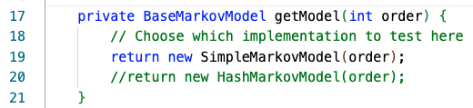
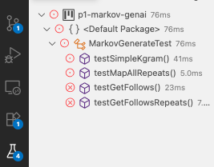

# Details for P1-Markov, Fall 2026

You should have already read the [README](../README.md) file to get an overview of the project. The details here are needed to explain the classes you're given, the code you'll write, and the implementation details.

## Starter Code and Using Git
**_You should have installed all software (Java, Git, VS Code) before completing this project._** You can find 
the [directions for installation here](https://coursework.cs.duke.edu/201fall26/resources-201/-/blob/main/installingSoftware.md) (including workarounds for submitting without Git if needed).

We'll be using Git and the installation of GitLab at [coursework.cs.duke.edu](https://coursework.cs.duke.edu). All code for classwork will be kept here. Git is software used for version control, and GitLab is an online repository to store code in the cloud using Git.

For this project, you **start with the URL linked to course calendar**, [https://coursework.cs.duke.edu/201fall26/p0-person201](https://coursework.cs.duke.edu/201fall26/p0-person201).

**[This document details the workflow](https://coursework.cs.duke.edu/201fall26/resources-201/-/blob/main/projectWorkflow.md) for downloading the starter code for the project, updating your code on coursework using Git, and ultimately submitting to Gradescope for autograding.** We recommend that you read and follow the directions carefully this first time working on a project! While coding, we recommend that you periodically (perhaps when completing a method or small section) push your changes.

## Completing the Coding Part of P1

Here is a summary of what you will do in this project:
- fork and clone (or download zip) the project files
- run ChatGPTDriver which uses the provided `SimpleMarkovModel` class (and fails)
- design, implement, test `SimpleMarkovModel` which uses brute-force to generate text
- design, implement, test `HashMarkovModel`which does this more efficiently
- answer analysis questions (you will need both models working)

## Java Background 

For completing P1, the Java concepts described below will be helpful. Understanding these may help you in completing the implementation of `SimpleMarkovModel` that is the first part of Project 1.

### Basic Inheritance

You've seen a brief introduction to the class `Object` that is the base class for every Java class. Classes in Java can _overload_ inherited methods `toString` and `equals` as was seen in `Person201` from Project 0. In this project, you'll write `SimpleMarkovModel` by overloading one method inherited from `BaseMarkovModel` and using the other methods without changing them from `BaseMarkovModel`.

### What is an immutable List<String> for this project?

The sequence of words used to generate random text in this (and the next) project is represented in code by an immutable `List<String>`. 
The size of the lists used is the order of the Markov Model. The lists are immutable so that your code cannot inadvertently change
them. This will be important in implementing `HashMarkovModel` and later in Project 2.

Several methods in the class `BaseMarkovModel` return an immutable list: `createNewContext`, `getSequence`, and `getRandomContext`. 

See the code in [`BaseMarkov`](../src/BaseMarkovModel.java) for details. Each
method uses `List.copyOf` to create what is essentially an immutable `ArrayList`.

The number of strings contained in a model's context is sometimes called the *order* of the model, 
the term used in the Markov programs you'll implement.  You can see some examples of order-3 `List<String>` objects below.

| | | |
| --- | --- | --- |
| "cat" | "sleeping" | "nearby" |
| | | |

and 
| | | |
| --- | --- | --- |
| "chocolate" | "doughnuts" | "explode" |
| | | |


## What is a Markov Model?

Markov models are random models with the Markov property -- there's no memory, a random choice is based on the current state. In this project you can think of the Markov Model as a _small language model_. 
You've heard about Duke/ChatGPT, Claude, Gemini and other _large language models_. In our case, we want to create a Markov model 
for generating random text that looks similar to a training text. Your code will generate one random word at a time, and the 
Markov property in our context means that the probabilities for that next word will be based on the previous words -- 
more precisely on 3 previous words in an order-3 Markov Model and the `k` previous words in an order-`k` Markov model.

An order-k Markov model uses length-three `List<String>` contexts to predict text: we sometimes call these *k-grams* where *k* 
refers to the order. To generate random text based on a training model the following steps occur in the method `BaseMarkov.generate`:

 - select a starting random k-gram _context_ from the *training text* (the data we use to create our model by calling the 
method `getRandomContext`; we want to generate random text based on the training text).
 - look for every instance of that k-gram/context in the training text to calculate the probabilities corresponding to words that might follow the context by calling the method `randomNextString` which calls the method `getFollows` **which you must implement in `SimpleMarkovModel` **.
 - repeat the process with a new context by calling `createNewContext` which uses the last k-1 words from the previous context and 
the newly generated word to create the next context. 

Here is a concrete example. Suppose we are using an order-2 Markov model with the following training text:

```
this is a test
it is only a test
do you think it is a test
this test it is ok
it is short but it is ok to be short
```

We begin with finding a random 2-gram, suppose we get `[it, is]`. 
This appears 5 times in total, and is followed by `only`, `a`, `ok`, `short`, 
and again by `ok` for the five occurences of `[it is]`. So the probability (in the training text) that `it is` is followed by `ok` is 2/5 or 40% and for the other words is 1/5 or 20%. To generate a random word following the 2-gram `[it, is]`, 
we would therefore choose `ok` with 2/5 probability, or `only`, `a`, or `short` with 1/5 probability each.

Rather than calculating these probabilities explicitly, your code will use these probabilities implicitly. 
In particular, the `SimpleMarkovModel.getFollows` method you write must return a `List<String>` of *all* of the words that follow after a given context in the training text (including duplicates). This list is used by the method `BaseMarkovModel.randomNextString` to choose one of these words uniformly at random. 
Words that more commonly follow will be selected with higher probability by virtue of these words being duplicated in the `List<String>` of following words. 
In our example above with `[it is]` the `getFollows` method would return the `List<String>` `["only", "a", "ok", "short", "ok"]`.

Suppose your code chooses `ok` as the next random word. Then the random text generated so far is `it is ok`, and the current
context `List<String>` of order 2 we are using would be updated to `[is, ok]` --- by dropping the `it` and adding `ok` (by calling `createNewContext` with the existing context and the chosen word).

We then again find the following words in the training text, and so on and so forth, until we have generated the desired number of random words.

Of course, for a very small training text these probabilities may not be very meaningful, but random generative models like this can be much more powerful when supplied with large quantities of training data, in this case meaning very large training texts.

## The Chat201Driver class

*You will modify the `main` method in this class to answer analysis questions.*

- Some static variables used in the main method are defined at the top of class, namely:
  - `TEXT_SIZE` is the number of words to be randomly generated.
  - `RANDOM_SEED` is the random seed used to initialize the random number generator. You should always get the same random text given a particular random seed and training text.
  - `MODEL_ORDER` is the order of `List<String>`s that will be used as contexts.
  - The `dirname` defined at the beginning of the main method determines the folder/files that will be used for the training text. 
By default it is set to `data/shakespeare`, meaning the text of eight works of Shakespeare is being used. Note that data files are located inside the data folder.
- A `BaseMarkovModel` object named `model` is created. By default, it uses `SimpleMarkovModel` as the implementing class, a partial implementation of which is provided in the starter code.
- The `model` then sets the specified random seed. You should get the same result on multiple runs with the same random seed. Feel free to change the seed for fun while developing and running, but *the random seed should be set to 1234 as in the default when submitting for grading*.
- The `model` is timed in how long it takes to run two methods: first `model.trainDirectory()` and then the method `model.generate()`.
- Finally, values are printed: the time it took to train (that is, for `trainText()` to run) the Markov model and to generate random text using the model (that is, for `generate` to run). The first and last 100 words generated are printed as well by calling the method `printNicely`.

### Running Driver Code

The primary driver code for this assignment is located in `Chat201Driver.java`. You should be able to run 
the `public static void main` method of `Chat201Driver` 
immediately after cloning the starter code, and should see something like the output shown below (noting that your exact 
runtimes will likely be different / machine dependent). Note that *there is no random text generated* 
because the code in `BaseMarkovModel.getFollows` does *not* work. After completing the code in `SimpleMarkovModel.getFollows` this program should generate different output.

**Example output of `Chat201Driver` with starter code.**

```
size of final sequence = 177690

Trained on text data/shakespeare with # tokens = 177674
Number of different contexts = 117189
Training time = 0.101 seconds
Exception in thread "main" java.lang.RuntimeException: 
zero size follows for [Fates,, we]
        at BaseMarkovModel.randomNextString(BaseMarkovModel.java:232)
        at BaseMarkovModel.generate(BaseMarkovModel.java:254)
        at Chat201Driver.main(Chat201Driver.java:43)
```

This throws an exception because the `Chat201Driver` code uses a `SimpleMarkovModel`which inherits `BaseMarkovModel.getFollows` that returns an empty list. You'll change this when you complete `SimpleMarkovModel`. 


## Coding Part 1: Developing the SimpleMarkovModel Class

In this part you will develop a Markov model for generating random text by extending `BaseMarkovModel` in the class
`SimpleMarkovModel`, and then using that class in `Chat201Driver` to test the methods you have written.
The class `SimpleMarkovModel` has been started, you must complete it by overriding and implementing `getFollows`, test it, run it (for analysis section).


After you implement and test you should see randomly-generated text such as that shown below:

```
size of final sequence = 177674

Trained on text data/shakespeare with # tokens = 177674
Number of different contexts = 117189
Training time = 0.106 seconds
Generated N=1000 random words with order 2 Markov Model
Generating time = 1.522 seconds
----------------------------------
will pay thy poverty and not a penny. Rom. Go to! You'll 
not endure it. You forget yourself To hedge 
----------------------------------
----------------------------------
or shall be shortly, single I'll resolve you, Which 
to you at meals, comfort your bed, And this fair 
----------------------------------
```

The method `Chat201Driver.getModel` returns
either a `SimpleMarkovModel` or a `HashMarkovModel`, the output should be the same except for the timings.

### Constructors

Two constructors in `SimpleMarkovModel` correspond to the two constructors in `BaseMarkovModel`. These include a *default* consructor that has the same body as the default constructor
in `BaseMarkovModel`. Your parameterized constructor must have as its first line
```
   super(size);
```
After this line include any code needed to initialize each instance variables you add (if any). Both constructors are provided in the code you download.

### Method `getFollows`

You must implement `getFollows` to find and return a `List<String>` that contains each individual string that follows _immediately after_
the parameter `List<String> context` in the training text. See the examples at the beginning of this document for an explanation. Your code
will find every order-k (where k is `myModelSize`) sequence in the instance variable `myWordSequence` using the `subList` method and
compare it for equality with `context`, building the returned `ArrayList` with Strings that follow
the `context`. This means you find every context that *has a string that follows it*! 

**Model the code you write on `BaseMarkovModel.differentContexts` which finds** every order-k subsequence
and stores them in a local `HashSet` variable --- think carefully about whether the last context has a following string. It may help to use concrete numbers: if `myWordSequence` has 10 elements, indexed 0-9. Then the last order-2 context is a 2-word context at indexes 8 and 9. The last order-2 context with a string that follows is the 2-word context at indexes 7 and 8, with the string at index 9 following. 

You may choose to override/implement other methods inherited as part of answering analysis questions, but that's likely unnecessary.


### Running and Testing SimpleMarkovModel

You can test your `SimpleMarkovModel` class with the `MarkovGenerateTest` JUnit tests (explained just.below).
Don't forget you will need to edit the code in method `getModel` to return a `SimpleMarkovModel` implementation when running your tests.

Once you are confident that your `SimpleMarkovModel` code is correct, you are ready to continue with implementing `HashMarkovModel`.

## JUnit Tests: how to run and use them

You'll develop code in one class first: `SimpleMarkovModel`. This has a corresponding JUnit testing program.
You should *absolutely* make sure your code passes these tests when implementing new methods.  For example, after coding `getFollows` you should use JUnit to
run the tests in `MarkovGenerateTest`.

To help test your `SimpleMarkovModel` and `HashMarkovModel` (Part 2, below) implementations, you are given some *unit tests* in the class
`MarkovGenerateTest.java`  located in the `src` folder. 
A unit test specifies a given input and asserts an expected outcome of running a method, 
then runs your code to confirm that the expected outcome occurs. You can see the exact tests inside of 
a Unit-test file, though it may be difficult to read/understand. The JUnit library used by these testing classes is a very 
widely-used industry standard for unit testing.

We use a major Java library called [**JUnit**](https://junit.org/junit5/) (specifically version 5) for creating and running these unit tests. 
It is not part of the standard Java API, so we have supplied the requisite files `JAR` files (Java ARchive files) along with this project in a folder 
called `lib` (you don't need to do anything with this).  

Note that by default, `MarkovGenerateTest` is testing the `SimpleMarkovModel` implementation, but 
tests will fail since `getFollows` is not implemented. When you are ready to test your `HashMarkovModel` implementation, 
you will want to change which model is created in the `getModel` method of `MarkovGenerateTest` at the position shown in the screenshow 
below (if the image does not render for you, you can find them in the `figures` folder). You will also make similar modifications
to the code in `Chat201Driver` since that class includes test methods.


<div align="center">
  
</div>


In order **to run these tests** inside VS Code, click the [Test Explorer](https://code.visualstudio.com/docs/java/java-testing#_test-explorer) (beaker) 
icon on the left side of VS Code (it should be the lowest icon on the panel). You can expand the arrow 
for `p1-markov` and the default package to see the unit test: `MarkovGenerateTest` (some text may be cut off).
You can click the run triangle next to each test package to run the tests. 
See the screenshot example below. *Note that JUnit programs are run by the JUnit library and the beaker-icon, do not be running them as Java programs.* 
You'll run the tests by clicking the triangle in the left panel, and you'll see the results in the _Test Results_ window 
rather than in the Terminal or Debugger window in VSCode.

For example, you can test all the tests in `MarkovGenerateTest` by hovering over that label in the _TestExplorer_ panel 
which is active when you click the Beaker-Icon, and is shown in the screenshot below. You can also run each individual 
unit test by hovering and clicking on each test's run triangle. The results of the tests are in the VSCode _TEST RESULTS_ panel, 
not in the other panels where output is shown. Deciphering error JUnit error messages is not always straightforward -- 
but when the tests pass? You'll get all green.

<div align="center">
  
</div>


## Coding Part 2: Developing the HashMarkovModel Class

The `SimpleMarkovModel` class scans the entire training text each time a random word is generated. For the `HashMarkovModel` class you
must scan the training text *once*, and store information in a `HashMap` so that random words can be
generated in `O(1)` time rather than `O(T)` time where `T` is the number of tokens/words in the training text. 

**Do NOT start Part 2 until after we have covered Maps on Monday, September 14 in class.**


### The HashMarkovModel class

This class *must extend* the class `BaseMarkovModel` just as the class `SimpleMarkovModel` does. This means your new class will
inherit the protected instance variables you'll see in `BaseMarkovModel`. Look at the class `BaseMarkovModel` for details.
Note that you are *NOT GIVEN* a starting .java file for `HashMarkovModel.java`.

You will need a `HashMap` instance variable that maps from `List<String>` (contexts/the keys) to `List<String>` (the values). You may find this useful:
```
    private HashMap<List<String>,List<String>> myMap;
```

**Note: the key `List<String>` represents a context. The value `List<String>` is each individual word that follows the context/key.**

### constructors

You'll need to implement two constructors that correspond to the two constructors in `BaseMarkovModel`. In
the class you write, you'll include a *default* consructor that has the same body as the default constructor
in `BaseMarkovModel`. Your parameterized constructor must have as its first line
```
   super(size);
```
For example, see `SimpleMarkovModel` code you get. You'll also need to assign to the `HashMap` private instance variable.

### The processTraining() method

You'll need to implement the `processTraining` method (which was not necessary in `SimpleMarkovModel`). This method
is called in `BaseMarkovModel` as the last line of both `trainDirectory` and `trainText`. **In `HashMarkovModel` the
code you write will populate (*after clearing*) the instance variable `myMap`.**

Note: you *must clear the `HashMap` instance variable* (for example, if the name of the variable is `myMap`, 
you can do this by calling `myMap.clear();`). This ensures that the map does not contain stale data if `processTraining()` 
is called multiple times on different training texts.

You should loop through the words in `myWordSequence` *exactly once*.
For each context `List<String>` of size `k`, where `k` is the order of the `HashMarkov` model, 
you'll use the `List<String>` as a key, and add the String that follows it as an entry in the`ArrayList` object 
that's the value associated with that `key` -- note that in the explanation above you'll see `List<String>` 
as the type of the value associated with each `List<String>` key in the map. This is possibly confusing. The key in
the map is a _context_, the order-k sequence/subList that is used to generate random text.  The value is
the list of *individual strings* that follows this context in the training text.

Your code *must create an `ArrayList` value to assign to each key in the map*, the `ArrayList` holds all the "next" words. You
typically only create the `ArrayList<String>` once, the first time a context/key is found when looping over all contexts.sss

There are at least two code fragments on which you can model the code you're writing in `processTraining`. Both rely on using a loop eerily similar to the loop you wrote in `SimpleMarkovModel.getFollows` which found every context.  As in that code, you can use `subList` to create a context. Alternatively, you could create the first context explicitly before any loop using `myWordSequence.subList(0,myModelSize)`. Then, in the body of your loop, you can create the next context by calling `createNewContext` as is done in `BaseMarkov.generate`.


You'll find code very similar to this in the `SimpleMarkovModel` method `getFollows` since some of that logic now moves into the the `HashMarkovModel` method `processTraining`. 
When your code looks up a context `List<String>` as a key in the `HashMap` instance variable, 
your code will create a new `ArrayList` as the value associated with that key the first time the context occurs. 
Then your code will call `myMap.get(context).add(str)` where `str` is a string that occurs after the `context`. 
Note that the values in the `HashMap` have type `List<String>`, but you'll create new `ArrayList` objects 
(since `List` is an interface).


### The getFollows() method


Just like in `SimpleMarkovModel`, the `getFollows` method takes 
a `List<String>` object `context` as a parameter and should return a `List` of all the words (containing `String` objects) that follow the `context` in the training text. However, the `HashMarkovModel` implementation *must* be more efficient, as it does *not* loop over the training text, but should instead *simply lookup the context `List<String>` in the `myMap` instance variable intialized during `processTraining()`*, or return an empty `List` if the `context` is not a key in the map. 

*This means that the `getFollows` method will be `O(1)` instead of `O(T)` where `T` is the size of the training text.*


## Analysis Questions

Answer the following questions in your analysis. You'll submit your analysis as a separate PDF as a 
separate assignment to Gradescope. Answering these questions will require you to run the driver code to 
generate timing data and to reason about the algorithms and data structures you have implemented. 
A template file for submitting your answers is [provided as a .docx file](p1-markov-analysis.docx).

### Working Together for Analysis

You're *strongly encouraged* to work with others in 201 in completing the analysis section for this project. 
In future projects you'll work on an entire project in pairs, and submit once for the pair. For this project, however, 
each person should submit independently. If you actively work with one or more people in 201, *please make sure* you list each other 
in the analysis document you turn in. 

*For your analysis repsonses* [please use this template](https://coursework.cs.duke.edu/201fall26/p1-markov-spring2026/-/blob/main/docs/p1-markov-analysis.docx). 

### Big-O/O-notation for analysis questions

For the analysis, let $`N`$ denote the length/number of words of the random text being generated. 
Let $`T`$ denote the number of words of the training text. Assume that *all words are of at most a constant length* 
(say, no more than 35 characters). To help in using the folders nested in the `data` folder, here 
are is some information about total number of words (and the number of files in each folder):

|file    |# files| # total words|
|--------|---------------|--------------|
|shakespeare | 8 | 177,642 |
|melville| 4 | 419,777|
|cbronte | 3 | 466,027|
|twain | 5 | 516,074|
|onefile | 1 | 28,196|
|twofiles | 2 | 56,392 |
|hesse| 3 | 149,532|

*Note*: these are the _actual_ number of words in each folder. The Markov model sequences will report *more* than these, depending on the order of the
model, because each file has `<START><START> ... <START>` and corresponding `<END>` tags inserted when training. The differences don't matter when analyzing using O-notation.

### Question 1 (4 points)

The code prints the size of the training text and how long it takes to train and to generate random text using the simple Markov model
embodied in `SimpleMarkovModel`. Copy/paste the sizes and times using different training texts

What is the asymptotic (big O) runtime complexity of each of the methods `trainDirectory()` and `generate()` for the `SimpleMarkovModel`
 implementation in terms of $`N`$ and $`T`$? State your answers, and justify them in *both* of the following ways.

- *Theory*. Explain why you expect `trainDirectory()` in `SimpleMarkovModel` and `generate()` from `SimpleMarkovModel` 
as the model to have the stated runtime complexity by referencing the algorithms/data structures/code used. 
Explain the complexity of each operation/method, accounting for any looping, in the code. 
You may assume that `nextInt` is a constant time operation to generate a random number and that reading the training
files takes `O(T)` time.

- *Experiment*. Run the main method of `Chat201Driver` with *at least* 3 different data folders 
of varying sizes $`T`$ (it is fine to use `data/onefile/alice.txt` for one of them). For each, run 
the main method with *at least* 3 different values of `TEXT_SIZE` (which corresponds to $`N`$). 
So you should have a total of at least 9 data points; use these to fill out a table like the one shown below.
 *Explain how your empirical data does or does not conform to your expectations for the runtime 
 complexity of `generate()`.*

| Data file    | $`T`$    | $`N`$    | Training Time (s)    | Generating time (s)    |
| ------------ | -------- | -------- | -------------------- | ---------------------- |
| twain        | 516,074  | 100      | ...                  | ...                    |
| ...          | ....     | ...      | ...                  | ...                    |

*Suggestions*: You will likely get the clearest data if you include very different values for $`T`$ and $`N`$, 
and preferably larger values -- see the table of sizes above to help you choose folders/text files you'll use. 
You can set $`N`$ directly to much larger values by changing `TEXT_SIZE`, for example to 1,000 or 10,000. 
Note that `SimpleMarkovModel` is not necessarily an efficient implementation, 
so it may take a long time to run with large $`T`$ and $`N`$. You do not need to run anything for multiple minutes 
just for data collection for this assignment.  

### Question 2 (4 points)

Same as Question 1, but for `HashMarkovModel` instead of `SimpleMarkovModel`: 
What is the asymptotic (big O) runtime complexity of the methods: `trainDirectory()` 
and for the `generate` method when  a `HashMarkovModel` is used in terms of $`N`$ and $`T`$? 
State your answers, and justify them in *theory and experiment* exactly as you did for Question 1. 

You can use the same training texts and values for $`N`$ as you chose in question 1, 
with the same suggestions mentioned there. Note that, implemented correctly, `HashMarkovModel` 
should be noticably more efficient at generating random text than `SimpleMarkovModel`, and this should be evident in your analysis.

### Question 3 (4 points)

Markov models like the one you implemented in this project are one example of a larger research area in artificial intelligence (AI) 
and machine learning (ML) called *generative models* for *natural language processing*. Currently, one of the state-of-the-art models is 
 *GPT*, created by [OpenAI](https://openai.com/about/). OpenAI states that their 
 "mission is to ensure that artificial general intelligence---AI systems that are generally smarter than humans—benefits all of humanity."
 Note that in [2022](https://web.archive.org/web/20220619093030/https://openai.com/about/) the OpenAI wording was different including: 
 "highly autonomous systems that outperform humans at most economically valuable work—benefits all of humanity." 

GPT is not, however, open-source, meaning that the underlying source code of the model is not freely available and the model is only 
accessible via API calls. Read this [short article from Nature about DeepSeek, an open-source LLM](deepseek-nature.pdf). 

Answer the following related questions **without using an LLM**:
- What do you think of OpenAI's stated mission? In particular, do you think that "highly autonomous systems that outperform humans at most economically valuable work" can benefit all of humanity? Why or why not?
- What is the main message from the Nature article about DeepSeek and other models?
- What questions/areas (you must have at least one) would you like to know more about? 

There is no right or wrong answer to these questions; we are looking for one or two paragraphs of thoughtful reflection.


The main benefit of JUnit tests lies in their ability to examine isolated "units" of code — that is, to check correctness of a segment with minimal reliance on other relevant code and data. Additionally, the purpose of supplying these *local* (on your own machine) tests is to allow you to catch potential problems quickly without needing to rely on the (somewhat slower) Gradescope autograder until you are reasonably confident in your code. You do not have to use them for a grade.
 


